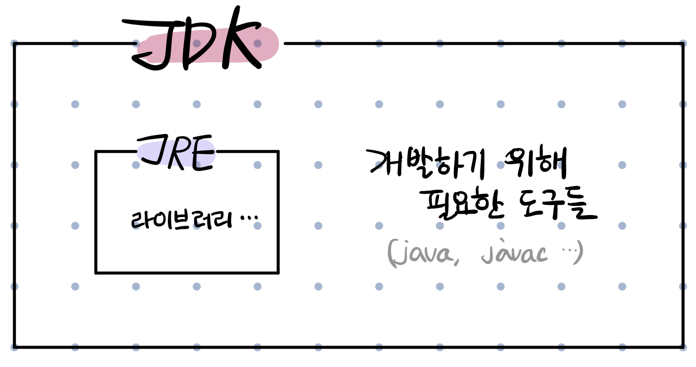

# 1주차 과제: JVM은 무엇이며 자바 코드는 어떻게 실행하는 것인가. #

## 목표 ##
자바 소스 파일(.java)을 JVM으로 실행하는 과정 이해하기.

## 1) JVM이란 무엇인가 ##
* JVM - Java Virtual Machine
* 소프트웨어로 구성된 에뮬레이터로서 운영체제와 자바 프로그램 사이에서 자바 프로그램이 실행될 수 있는 환경을 제공. 
* 즉 JVM은 자바 프로그램을 운영 체제가 이해할 수 있는 형식으로 변환하여 운영체제에 전달하는 역할을 수행한다.

## 2) 컴파일 하는 방법 ##
`javac test1.java`
* 'javac'는 java 파일을 컴파일 하여 .class 파일을 생성한다.

## 3) 실행하는 방법 ##
`java test1`
* 'java'는 컴파일 된 파일을 실행시킨다.

## 4) 바이트코드란 무엇인가 ##
* 자바 컴파일러에 의해서 생성되는 코드를 가리켜 '자바 바이트코드(Java bytecode)'라 한다.
	* 이는 자바 컴파일러에 의해서 생성되는 코드의 명령어 크기가 1바이트이기 때문에 붙여진 이름.
* 자바 가상 머신이 실행하는 명령어의 형태이다.
* 고급 언어(C, Java 등)가 아닌 중간 단계인 '바이트코드' 형태를 가지면 가상 머신이 실행할 수 있다.

## 5) JIT 컴파일러란 무엇이며 어떻게 동작하는지 ##
* JIT(Just-In-Time) 컴파일러 : 바이트 코드를 읽어 런타임에 기계어로 변환하는 컴파일러이다.

https://m.blog.naver.com/ki630808/221844888233
* 런타임에 바이트 코드를 기계어로 컴파일한다.
* 컴파일된 코드를 명령이 수행되는 프로세서로 전송한다.

## 6) JVM 구성 요소 ##

* 클래스 로더 : 자바는 런타임에 클래스를 처음으로 참조할 때 해당 클래스를 로드하고 링크하는 특징이 있다.
* 런타임 데이터 영역 : JVM이라는 프로그램이 운영체제 위에서 실행되면서 할당받는 메모리 영역이다.
* 실행 엔진 : 클래스 로더를 통해 JVM 내의 런타임 데이터 영역에 배치된 바이트코드는 실행 엔진에 의해 실행된다. 실행 엔진은 자바 바이트코드를 명령어 단위로 읽어서 실행한다. 

## 7) JDK와 JRE의 차이 ##
JDK가 JRE를 포함한다. JDK는 JRE뿐 아니라 개발에 필요한 도구(java, javac 등)를 포함한다.

JDK(Java Developement Kit, 자바 가상 머신)
* 자바로 프로그램을 개발하기 위해 필요한 기본 도구

JRE(Java Runtime Environment, 자바 실행 환경)
* 필요한 라이브러리 파일 등을 포함
* 컴파일 된 자바 프로그램을 실행 할 수 있는 환경

## 참고 ##
* https://d2.naver.com/helloworld/1230