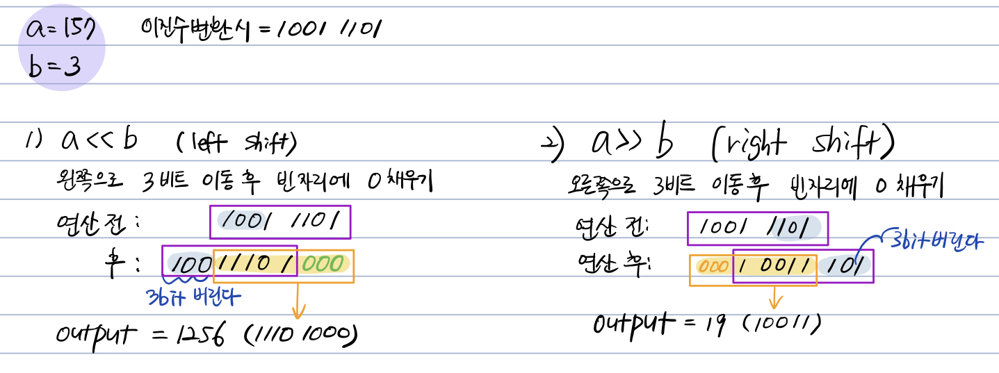

# 3주차 과제: 연산자 #

## 목표 ##
자바가 제공하는 다양한 연산자 학습하기.

* 연산자 : +,-와 같이 연산을 나타내는 기호를 의미한다.
* 수식 : 연산자와 피연산자로 구성된 수식을 의미한다.
* 연산자의 사용형태는 크게 3가지이다.
	* 단항 연산자 : 하나의 피연산자만을 가진다.
	* 이항 연산자 : 하나의 연산자에 두개의 피연산자를 가진다.
	* 삼항 연산자 : 3개의 피연산자를 가진다.

## 1) 산술 연산자 ##
* 단항 연산자인 ++연산자와 --연산자는 피연산자로 변수만 사용 가능하다.

|연산자|사용법|설명|비고|
|---|------|---------------|-----|
|+|op1+op2|op1과 op2를 더한다.|단항 및 이항|
|-|op1-op2|op1에서 op2를 뺀다.|단항 및 이항|
|*|op1*op2|op1과 op2를 곱한다.|이항|
|/|op1/op2|op1을 op2로 나눈다.|이항|
|%|op1%op2|op1을 op2로 나눈 나머지를 구한다.|이항|
|++|var++|var 값 1 증가. var 값 증가시키기 전에 평가|단항|
||++var|var 값 1 증가. var 값 증가시킨 후 평가|단항|
|--|var--|var 값 1 감소. var 값 감소시키기 전에 평가|단항|
||--var|var 값 1 감소. var 값 감소시킨 후 평가|단항|

```java
public class week03{
     public static void main(String []args){
        int a=5, b=2;
        
        int sum = a+b;
        System.out.println("a+b=" + sum); // output 7
        int sub = a-b;
        System.out.println("a-b=" + sub); // output 3
        int mul = a*b;
        System.out.println("a*b=" + mul); // output 10
        int div = a/b;
        System.out.println("a/b=" + div); // output 2
        int mod = a%b;
        System.out.println("a%b=" + mod); // output 1
        int prefixA = ++a;
        System.out.println("a의 전위 증가:" + prefixA); // output 6
        System.out.println("변수 a의 값" + a); // output 6
        int postfixB = b++;
        System.out.println("b의 후위 증가:" + postfixB); // output 2
        System.out.println("변수 b의 값" + b); // output 3
     }
}
```

---

* 산술 연산자 사용 시 정수의 경우는 int형으로 연산을 수행한다.
* 산술 연산자 사용 시 실수인 경우는 double형으로 연산을 수행한다.
* *알고리즘 문제 해결 시 연산 과정에서 오버플로우가 발생했던 경우가 있었는데, 아래의 예제를 통해 그때 왜 그런 결과가 나온 지 이해할 수 있었음.*


```java
public class week03{
     public static void main(String []args){
        // 자료형이 나타낼 수 있는 범위를 벗어난 사용과 형 변환의 예
        byte a=127, b=2;
        
        byte c = (byte)(a*b);
        System.out.println("a*b의 결과를 byte로 변환 출력:" + c); // output -2
        /*
            정수연산(a*b)은 묵시적으로 int형으로 실행된다.
            a*b는 int형으로 수행하고, byte형으로 변환하여 저장된다.
            계산된 결괏값은 254이며 byte형이 표현할 수 있는 범위를 벗어나므로
            하위 8비트만 표현되어 -2가 출력된다.
        */
        
        int d = a*b;
        System.out.println("a*b의 결과를 int로 출력:" + d); // output 254
        
        int i = 1_000_000, j=1_000_000;
        int k = i*j;
        System.out.println("백만*백만의 결과를 int로 출력:" + k); // output -727379968
        /* 백만*백만의 결과가 int형 표현 범위를 벗어나므로 하위 32비트만 표현*/
        
        long m = (long)(i*j);
        System.out.println("a*b의 결과를 long으로 변환 출력:" + m); // output -727379968
        /* int 연산이 실행되며 그 결과가 이미 int를 벗어난다. */
        
        m = (long)i*j;
        System.out.println("i를 long으로 변환 후 연산:" + m); // output 1000000000000
        /* 변수가 long형이므로 long 연산이 실행된다.*/
        
        m = (long)i*(long)j;
        System.out.println("i와 j를 long으로 변환 후 연산" + m); // output 1000000000000
        /* long 연산이 실행된다.*/
        
     }
}
```

           
## 2) 비트 연산자 ##
* 비트 연산자 : 2진수로 표현된 정수를 비트 단위로 취급하는 연산자이다.
	* 비트 논리 연산자와 비트 시프트 연산자로 구분한다.

* 비트 논리 연산자
	* 4)에서 언급할 논리 연산자(&&, ||, !)는 **피연산자가 true, false값을 가지는** 반면, 비트 논리 연산자는 비트 단위로 연산을 수행하며 **피연산자로 정수를 가질 수** 있다.
	* *보수 연산을 거의 사용해 본 적이 없었는데 이번 기회에 다시 생각 할 수 있었음.*

|연산자|사용법|설명|
|---|-----|--------------------|
| & | 5&7 | 5에 해당하는 101과 7에 해당하는 111을 비트 단위로 AND한다. |
| l | 5l7 | 5에 해당하는 101과 7에 해당하는 111을 비트 단위로 OR한다. |
| ^ | 5^7 | 5에 해당하는 101과 7에 해당하는 111을 비트 단위로 XOR한다. |
| ~ | ~5 | 5에 해당하는 101의 보수를 취한다. |

```java
public class week03{
     public static void main(String []args){
        // 비트 논리 연산자 예
        
        int a=14;
        int b=11;
        System.out.println("a = " + a + "(" + Integer.toBinaryString(a) + ")"); // a = 14(1110)
        System.out.println("b = " + b + "(" + Integer.toBinaryString(b) + ")"); // b = 11(1011)
        
        System.out.println("a&b = " + (a&b) + "(" + Integer.toBinaryString(a&b) + ")"); // a&b = 10(1010)
        System.out.println("a|b = " + (a|b) + "(" + Integer.toBinaryString(a|b) + ")"); // a|b = 15(1111)
        System.out.println("a&b = " + (a^b) + "(" + Integer.toBinaryString(a^b) + ")"); // a^b = 5(101)
        System.out.println("~b = " + (~b) + "(" + Integer.toBinaryString(~b) + ")");
        /* ~b = -12(11111111111111111111111111110100)
        1011의 보수를 출력하는데, 보수가 되면서 의미 있는 32비트 모두 출력된다.
        1011의 32비트 보수는 11111111111111111111111111110100이며 정수로 표현하면 2의보수 표현법이 되어 -12가 출력된다.*/
     }
}
```

---

* 시프트 연산자
	* 피연산자로 정수만 사용 가능하다.
	* 피연산자가 홀수인 경우 오른쪽 시프트의 결과가 정수로만 나타나기 때문에 정확하지 않을 수 있다.

* 시프트 연산자 중, 논리 시프트 연산자 >>>
	* unsigned right shift, 부호가 없으며 결과값은 *항상 양수*이다.
	* 자바에만 있는 연산으로 '>>' 연산자와 같은 원리를 가지며, 다른 점은 부호 비트에 관계 없이 무조건 0을 채운다.

|연산자|사용법|설명|
|---|-----|--------------------|
| << | a<<n | 정수 a를 비트 단위로 왼쪽으로 n비트 시프트한다. 빈 비트에는 0을 채운다. 결과는 a*(2^n) |
| >> | a>>n | 정수 a를 비트 단위로 오른쪽으로 n비트 시프트한다. 빈 비트에는 연산 전 부호 비트를 채운다. 결과는 a/(2^n) |
| >>> | a>>>n | 정수 a를 비트 단위로 오른쪽으로 n비트 시프트한다. 빈 비트에는 0을 채운다. 부호 비트를 고려하지 않기 때 문에 a가 음수일 경우 시프트 결과는 양수로 나타낸다. |

<br>


```java
public class week03{
    public static void main(String []args){
        // 시프트 연산자 예
        
        int a=-157; // a = -157(11111111111111111111111101100011)
        int b=3; 
        
        System.out.println("a<<b : " + (a<<b) + "(" + Integer.toBinaryString(a<<b) + ")"); 
        System.out.println("a>>b : " + (a>>b) + "(" + Integer.toBinaryString(a>>b) + ")");
        System.out.println("a>>>b : " + (a>>>b) + "(" + Integer.toBinaryString(a>>>b) + ")");
        /*
        a<<b  : -157      (11111111111111111111101100011000)
        a>>b  : -1256     (11111111111111111111111111101100)
        a>>>b : 536870892 (11111111111111111111111101100)
        */
    }
}
```


## 3) 관계 연산자 ##

* 관계 연산자 : 이항 연산자로서, 두 개의 피연산자값을 비교하여 결과로 true, false를 반환하는 연산자이다.
	* 주로 선택문과 반복문의 조건식에 사용된다.
	* 두 개의 피연산자가 서로 다른 형일 경우, 자료형의 범위가 더 큰 쪽으로 자동 형 변환하여 비교한다.

|연산자|사용법|설명|
|---|---------|---------------|
| > | op1>op2 | op1이 op2보다 큰 경우 |
| >= | op1>=op2 | op1이 op2보다 크거나 같은 경우 |
| < | op1<op2 | op1이 op2보다 작은 경우 |
| <= | op1<=op2 | op1이 op2보다 작거나 같은 경우 |
| == | op1==op2 | op1과 op2가 같은 경우 |
| != | op1!=op2 | op1과 op2가 같지 않은 경우 |
| instanceof | op1 instanced op2 | op1이 op2의 객체인 경우|

```java
public class week03{
     public static void main(String []args){
        // 관계 연산자 예
        
        byte a=20;
        double d=3.14;
        boolean flag;
        
        flag = a == 20.0f;
        System.out.println("a가 20.0f와 같은가? " + flag); // true
        /* byte형이 float형으로 자동으로 형 변환되어 비교 */
        
        flag = 10 != 10.0;
        System.out.println("10이 10와 같지 않은가 ? " + flag); // false
        /* 정수 리터럴 10이 실수로 변환되어 비교 */
     }
}
```


## 4) 논리 연산자 ##

* 논리 연산자 : 피연산자의 값을 평가하여 결과로 ture, false 값을 반환하는 연산자이다.
	* 피연산자가 반드시 true, false 값을 가져야 한다.
	* 피연산자가 수식으로 오는 경우에도, 수식의 결과가 true, false 값이어야 한다.
* ||(이항 연산자), &&(이항 연산자), !(단항 연산자) 가 존재한다.

| x | y | xlly | x&&y | !x |
|----|----|-----|-----|----|
| true | true | true | true | false|
| true | false | true | false | |
| false | true | true | false | true |
| false | false | false | false | |


```java
boolean flag;
flag = 30<20;
flag = 30&&20; // error!
flag = 30<20 || 50>20;
flag = 30<20 && 80; // error!
flag = 20+30 < 20*2;
flag = 20+30 || 20*2; // error!
// 피연산자가 true, fasle의 값이 아닐 때 에러 발생.
```

## 5) instanceof ##

`op1 instanceof op2` op1이 op2의 인스턴스(객체)인 경우
* op1에는 객체 또는 배열 값이 위치하고, op2에는 참조형의 이름이 위치한다.
	* 지정된 유형의 인스턴스일 경우 true를 반환하며, 그 외에는 false를 반환한다.
	* op1이 null일 경우도 false를 반환한다.
	* true를 반환한다면, 안전하게 캐스트하여 op2(참조형)에 할당할 수 있음을 알 수 있다.
* 참조형과 객체에만 사용할 수 있다.

```java
public class week03{
    public static void main(String []args){
        // instancefo 예
        
        System.out.println( ("string" instanceof String) ? "TRUE!" : "FALSE.."); // true
        System.out.println( ("" instanceof Object) ? "TRUE!" : "FALSE.."); // true
        System.out.println( (null instanceof String) ? "TRUE!" : "FALSE.."); // false
    
        Object o = new int[] {1,2,3};
        System.out.println( (o instanceof int[]) ? "TRUE!" : "FALSE.."); // true
        System.out.println( (o instanceof byte[]) ? "TRUE!" : "FALSE.."); // false
        System.out.println( (o instanceof Object) ? "TRUE!" : "FALSE.."); // true
        
        /*
        1) string은 String의 instance이다.
        2) string은 Object의 instance이다.
        3) null은 어떤것의 instance도 될 수 없다.
        4) 배열값은 정수 배열이다.
        5) 배열값은 바이트 배열이 아니다.
        6) 모든 배열은 Object의 instance이다.
        */
    }
}
```


## 6) assignment(=) operator ##

* 자바는 배정연산자로 = 를 제공하며 변수에 값을 저장하기 위해 사용한다.
* 배정 연산자의 왼쪽에는 반드시 변수만 올 수 있다.

* 단축 배정 연산자

|종류|연산자|의미|
|----------|---------------|-------|
|산술+배정| += -= *= /= %=| op1 =  op1+op2 |
|비트+배정| &= l= ^= | op1 = op1&op2 |
|시프트+배정| <<= >>=  >>>= | op1 = op1<<op2 |


## 7) 화살표(->) 연산자 ##

* -> : A lambda expression, Java 8에 추가 되었다.
	* 익명 함수를 만들 때 사용하는 연산자이다.
* 간결하여 가독성이 좋은 것이 장점이다.
` ( 매개변수1 , ... ) -> { 실행문.. } `

```java
Food orange = new Food();
        orange.eat( (a,b) -> {
            System.out.println("I'm Hungry.");
            System.out.println("I want to eat Orange..");
        });
```

* *사용경험이 적어서 익숙치 않다. 다양한 코드를 보고 작성 해봐야겠다.*
* 참고 : https://coding-factory.tistory.com/265

## 8) 3항 연산자 ##

* 자바는 3개의 피연산자를 가진 	` ? : `를 제공한다.
* 선택문 if-else문을 축약해서 사용할 수 있는 연산자이다.
> 수식1 ? 수식2 : 수식3`
* 첫번째 피연산자 수식1은 반드시 true 또는 false 값을 가진다.
	* 수식1의 값이 true이면 수식2가 평가되어 반환되고
	* 수식1의 값이 false이면 수식3이 평가되어 반환된다.

```java
int val = 10;
System.out.println(val != 10 ? "10이 아니다" : "10이다"); // output 10이다
```


## 9) 연산자 우선 순위 ##

* 동일한 수식에서 사용될 때 우선순위에 의해서 수행 순서가 결정된다.

|우선순위|연산자|형식|이름|
|---|-----|-------|-------|
| 1 | [] | a[b] | 인덱스 연산자 |
| | () | (a+b)*c | 괄호 |
| | . | a.b | 멤버 접근 연산자 |
| 2 | ++ | ++a | 증가 연산자 |
| | -- | a-- | 감소 연산자 | 
| | + | +a | 단항 +연산자 |
| | - | -a | 단항 -연산자 |
| | ! | !a | NOT연산자 |
| | ~ | ~a | 비트 보수 연산자
| 3 | new | new 클래스명 | new 연산자 |
| | () | (short) | 캐스트 연산자 |
| 4 | * | a*b | 곱셈 연산자 |
| | / | a/b | 나눗셈 연산자 |
| | % | a%b | 나머지 연산자 |
| 5 | + | a+b | + 연산자 |
| | - | a-b | - 연산자 |
| 6 | <<, >>, >>> | a<<b | 시프트 연산자 |
| 7 | <, >, <=, >= | a<b | 관계 연산자 |
| | instanced | a instanceof b | instanceof 연산자 |
| 8 | == != | a==b | 등가 연산자 |
| 9 | & | a&b | 비트 AND 연산자 |
| 10 | ^ | a^b | 비트 XOR 연산자 |
| 11 | l | alb | 비트 OR 연산자 |
| 12 | && | a&&b | AND 연산자 |
| 13 | ll | allb | OR 연산자 |
| 14 | ?: | a?b:c | 삼항 연산자 |
| 15 | = | a=b | 배정 연산자 |
| | *=, /= ... | a*=b .. | 단축 배정 연산자 11개 |


## 10) (optional) Java 13. switch 연산자 ##


## 참고 ##
* **Java in a Nutshell**, *Benjamin J.Evans David Flanagan*
* **처음시작하는 JAVA 프로그래밍**, *김충석 저*
